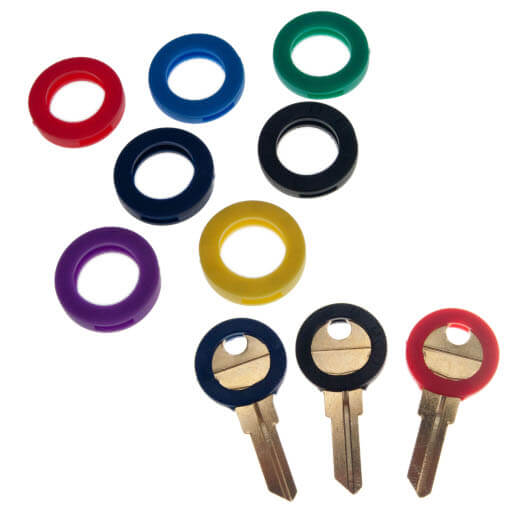

Welcome to the first in a series of posts around "Life Tips"; small little nuggets of (maybe) useful wisdom that I wish I'd known.

First up is a very mundane affair; keys! Not cryptography keys, real world keys with little metal teeth. Depending on how many places you need to get into, you may find yourself with quite a lot of keys on your keychain. This is a problem if they look quite similar.

A solution I've used is getting a pack of Key Covers; brightly coloured circles of plastic that just slip over the head of the key, and make it easy to tell at a glance which key is what.

They've got a few advantages over other solutions;

- Stickers need a solid surface to adhere to, and typically rub off from metal
  quite easily.
- Permanent marker usually only comes in a few colours, and also permanently
  marks the key in question.
- Key tags (little plastic containers with a card you can write on) can be
  bulky if you have enough keys that need an organization system in the first
  place, and can get smudged if wet.

(Image from https://keyring.com/key-identifier-ring-collars/)

> Disclaimer: I have not purchased or endorse the displayed product; image is for reference only.
