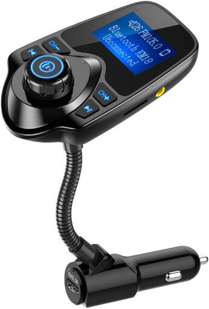

This is a life tip for everyone that uses their smartphone for music, but maybe has an older car without a bluetooth enabled radio.

Replacing the entire radio assembly of a car can be daunting, and also expensive depending on the car. One option you can get is a small bluetooth / FM transmitter device that plugs into the cigarette lighter; it never needs to be recharged and will almost always have excellent signal because it's very close to both your phone and the receiving radio.

Additionally, depending on the model you get, it can feature physical buttons which allow you to play/pause the music and charge track without taking your eyes off the road. Fiddling with a smartphone screen can range from dangerous to illegal, depending on where you are!

(Image from https://www.amazon.co.uk/Wireless-Bluetooth-Transmitter-Supports-Smartphones/dp/B018E0I01I)

> Disclaimer: I have not purchased or endorse the displayed product; image is for reference only.
