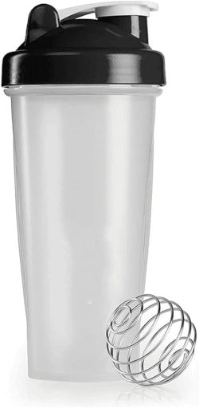

I'm not usually a big fan of protein shakes, or other shakes that you have to
put dried powder in then mix with fluid. More often than not, it doesn't mix
evenly and you get this semi-clumpy mixture with variable taste, which I just
can't stand.

However! I've started actually putting some effort into developing a technique
for mixing, and I think I've landed on something that makes a pretty even
mixture and also is pretty convenient to do on the go (like in the office). This
should work for protein powder, meal replacement shakes, or anything else
powdered.

---

The only piece of actual equipment I've been using is a shaker with a mixing
ball. Basically just a plastic bottle, and a metal wire curved into the shape
of a ball:

(Image from https://www.amazon.com.au/Protein-Supplement-Blender-Shaker-Bottle/dp/B0BWTTFVWY)

> Disclaimer: I have not purchased or endorse the displayed product; image is for reference only.

> **Tip**: My shaker has measurement markings on the side; this makes the
> technique a bit easier to do, but it's not required once you get the hang of it.

---

On to the steps! This is assuming you're mixing about one scoop / 100g of
powder into 500ml of fluid.

1. Add roughly 200ml of your chosen liquid; water, milk, whatever.
    - This is where the shaker measurement markings come in useful, but you can
      use an external measuring container, and once you get a rough idea of how
      much fluid that is you can mostly eyeball it anyway.
2. Add your scoop or sachet of powder.
3. Add the mixing ball.
4. Close the lid (make sure it's tight!) then give the bottle a vigorous shake
   for about 30 seconds.
    - This gets most of the powder at least somewhat wet, although the result
      will usually be more of an uneven slurry. Too much fluid at once tends to
      make the powder clump and never get mixed.
5. Open the lid, add the rest of the fluid.
6. Close the lid again, give the bottle another vigorous shake for another 30 -
   45 seconds.
    - This extra fluid should now get the shake to the consistency it should be,
      instead of a thick paste.
7. Leave the shake for about 10 minutes.
    - This helps the extra fluid permeate to all the last holdouts of unmixed
      powder.
    - If you prefer your shakes cold and have easy access, this is a good time
      to stick it in the back of the fridge.
8. After 10 minutes, give the shake a final shake for about 15 seconds.
9. Ready to go!
